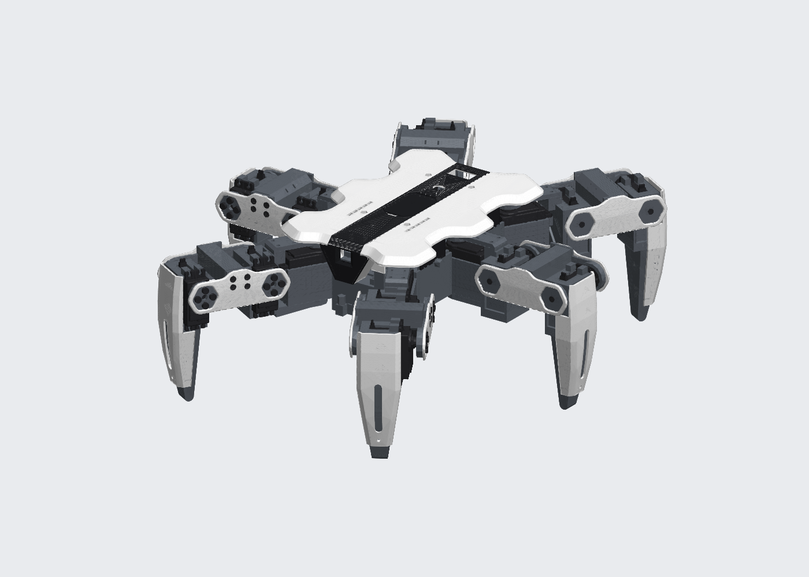

# Hexapod v2

Robot esapode a 18 gradi di libertà (6 zampe × 3 servo MG996R), stampato in 3D e comandato da un ESP32-S3 con camera e una SSC-32. Progetto personale, in fase di progettazione CAD.

## Dove guardare

| Documento | Contenuto |
|---|---|
| [Progetto meccanico](docs/progetto-meccanico.md) | zampa, corpo, assieme, verifiche di movimento, cavi, massa |
| [Decisioni](docs/decisioni.md) | registro delle scelte con il perché |
| [BOM](docs/BOM.md) | distinta base, schema di alimentazione, viteria, domande aperte |
| [Studio dei componenti](docs/studio-componenti.md) | servo, alimentazione, batteria, giunti, stampa |
| [Dimensionamento](docs/dimensionamento.md) | massa, geometria, coppie e assetti |
| [Dimensioni dei componenti](docs/dimensioni-componenti.md) | quote dei componenti con la fonte |
| [Ricerca](docs/ricerca/) | proposte e revisioni indipendenti di zampa e corpo |

## Cartelle

- `cad/script/`: script Python che costruiscono il modello in Fusion (`corpo.py`, `zampa.py`, `assieme.py`).
- `cad/stl/`: STL delle parti già pronte per i provini.
- `cad/modelli/`: fonti dei modelli STEP di terzi.
- `cad/render/`: render schematici del modello.
- `calc/`: calcoli di statica, andature, escursioni e cavi.

Lo stato del lavoro e i prossimi passi sono in [CLAUDE.md](CLAUDE.md).
