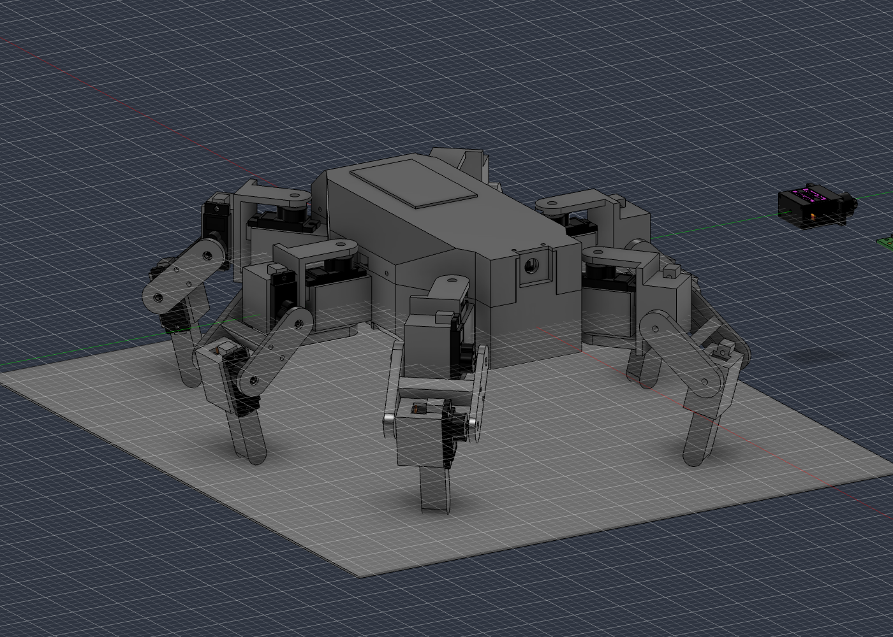
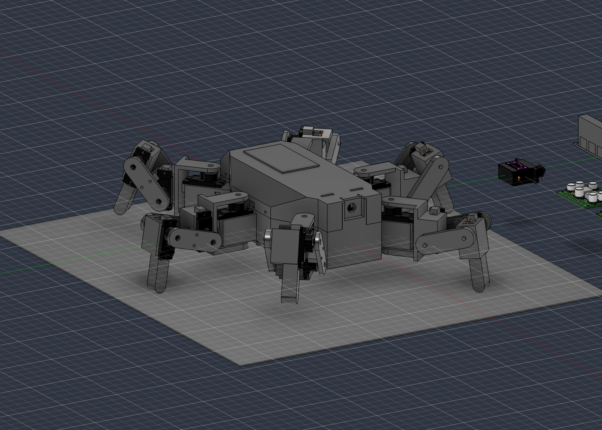
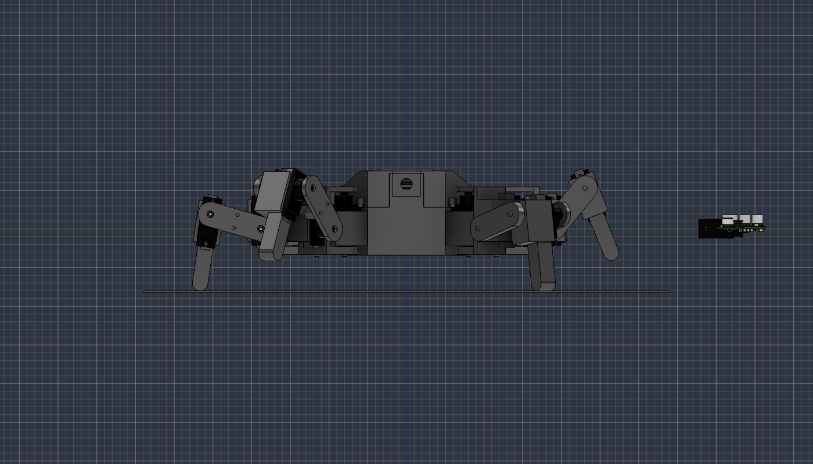
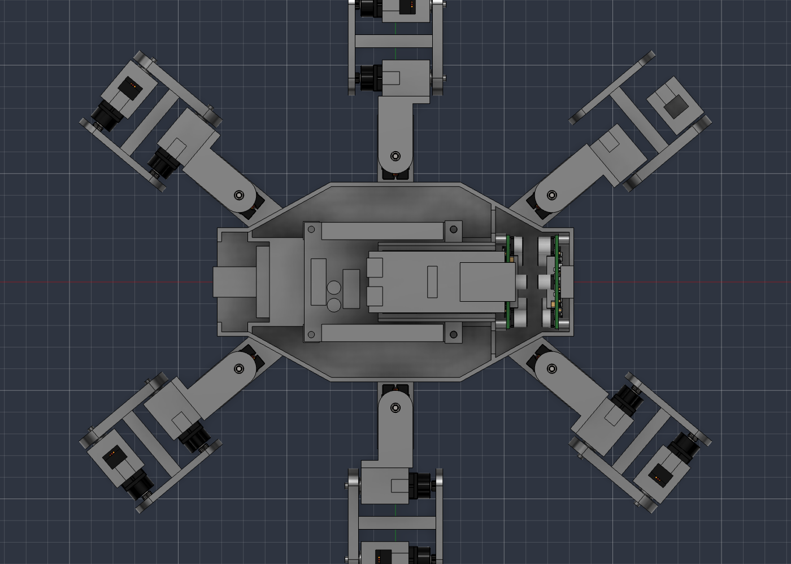

# Progetto meccanico

Stato all'8 ottobre 2026 (notte). In Fusion ci sono la **zampa v0** verificata, il **corpo v0** (base, guscio, vassoio dell'ESP32, due sportelli) e l'**assieme** con sei zampe, servo di coxa, elettronica e giunti, verificato anche nell'assetto di marcia. Mancano le rifiniture elencate in fondo a ogni sezione.

## Due modi di marcia

Il robot è progettato per camminare in due modi (D-039); quale usare, o quale via di mezzo, si decide a robot costruito. Calcoli: `python3 calc/andature.py` e `calc/assetti.py`; tabella completa in `dimensionamento.md`.

| | Modo alto e raccolto | Modo basso e largo |
|---|---|---|
| Asse dei femori da terra / piede dall'asse | 72 mm / 12 mm | 40 mm / 40 mm |
| Luce sotto il corpo | 55 mm | 23 mm |
| Femore in appoggio | da −52° a −40° (verso il basso) | da +8° a +17° (verso l'alto) |
| Ginocchio in appoggio | 117–134° | 66–109° |
| Coppia massima a tripode | 44 % dello stallo | 89 % |
| Ribaltamento statico | 29° | 54° |
| Parametri | `zam_h`, `zam_xf0` | `zam_h_basso`, `zam_xf0_basso` |

- **Perché due**: la coppia è carico per distanza orizzontale tra piede e asse. Con 18 MG90S e circa 1 kg il modo alto è l'unico sotto il 50 % dello stallo; il modo basso è più stabile e fa passi più lunghi, ma porta i servo di femore vicino allo stallo. L'utente accetta di salire sopra il 50 %.
- **Verifica sul modello**: ciclo a tripode completo, dieci fasi per modo, sei zampe atteggiate una per una (`assieme.py` → `ciclo`), passo 40 mm e alzata 20 mm. Nessuna interferenza in nessuna fase. Angoli usati: modo alto coxa ±22,6°, femore da −52,4° a −11,5°, ginocchio da 76,3° a 133,6°; modo basso coxa ±14,7°, femore da +7,8° a +51,0°, ginocchio da 54,7° a 109,0°. Tutti dentro i limiti della zampa.
- **Proporzioni**: lo spessore del corpo (54,5 mm) è la somma di batteria, SSC-32 con le spine verticali dei servo e pila dell'ESP32: si recuperano al più 1–2 mm. Il profilo è alleggerito dal guscio sfaccettato e dallo smusso del fondo. La tibia resta a 50 mm (`zam_Lt`).
- **Le prime immagini** dell'assieme mostravano la posa di riferimento del CAD (femore orizzontale, tibia verticale, luce 33 mm): non è una posa di marcia.

## Zampa v0 (modellata)

Script: `cad/script/zampa.py` (parti, istanze, giunti), `cad/script/lib_cad.py` (schizzi vincolati), `cad/script/verifica_zampa.py`.

### Architettura

| Parte | Cosa fa | Come si stampa |
|---|---|---|
| `Coxa` | forcella a C attorno al servo della coxa (braccio superiore sulla squadretta, braccio inferiore sul perno) + anima verticale + culla del servo del femore | faccia −Y sul piano |
| `Femore_B` | piastra lato perni con i due perni, più il puntone e la testa che la uniscono all'altra piastra | piastra sul piano, puntone in piedi, supporti sotto la testa |
| `Femore_A` | piastra lato squadrette: porta tutta la coppia tra i due giunti, avvitata alla testa del puntone con 2 viti M2 in inserti | in piano |
| `Tibia` | culla del servo del ginocchio, coda verso il piede, più stinco e piede | faccia −Y sul piano |

Dentro `Zampa`: 2 servo, 2 cuscinetti F683ZZ, 3 perni Ø3 × 10 (anca, ginocchio, coxa). Il servo della coxa e il suo cuscinetto appartengono al corpo.

Scelte e perché:

- **Servo della coxa** nel corpo, albero in alto, **coda verso l'esterno**: il cavo esce verso l'interno del corpo. Costa una coxa più lunga: l'anima deve stare oltre le alette del servo (raggio 22,9 mm), quindi a x = 24,2 mm.
- **Servo del femore** con lato lungo verticale e **coda in alto**: con la coda in basso o in orizzontale l'anima del femore lo urterebbe.
- **Femore in due pezzi**: una forcella in un pezzo solo non si infilerebbe sull'albero senza tagliare la piastra. Le due squadrette puntano verso il centro del femore; le viti stanno a ±4,5 mm dalla mezzeria per non cadere nelle sedi delle squadrette.
- **Puntone al posto dell'anima piena** (D-039): le due culle, ruotando, spazzano quasi tutto lo spazio tra le piastre. Resta libera una fascia inclinata al centro del femore: lì passa un puntone di 6,2 × 4 mm inclinato di 35°. Accanto alla piastra delle squadrette, sopra la cassa dei servo (y > 11 mm), le culle non arrivano: lì l'anima torna piena (6 × 15 mm) e porta i due inserti. Così il ginocchio si chiude fino a 50° e il femore sale fino a +55°.
- **Coxa in un pezzo**: si infila di lato sulla gondola; la sede della squadretta sul braccio superiore è una scanalatura aperta verso l'estremità libera, da cui entra la squadretta già montata sull'albero.
- **Giunto**: cuscinetto nel fondo della culla (sede profonda 2,2 mm, flangia fuori a battuta); perno forzato nel braccio, infilato per ultimo dall'esterno, sporgente 1,5 mm per poterlo estrarre; un rialzo Ø4,2 × 0,4 tocca solo l'anello interno.
- **Carico assiale**: la spinta del suolo passa dal rialzo del braccio all'anello interno del cuscinetto e al fondo della culla, non all'albero del servo.
- **Cavo del servo**: cavo e vite dell'aletta stanno sulla stessa mezzeria, quindi il cavo non può scendere lungo la parete. Sotto la bugna c'è una **finestra** larga 9 mm: prima si infila la spina JR, poi si cala il servo.
- **Servo nel modello**: posizionato con le alette appoggiate sull'orlo della culla (nello STEP il sotto-aletta è a 18,4 mm, la quota ufficiale è 18,5).
- Nel modello i fori di perni e cuscinetti sono **nominali**: il forzamento si tara con un provino (`perno_foro`, `cus_sede_d`).

### Quote principali (parametri utente)

| Grandezza | Valore | Parametro |
|---|---|---|
| Semilarghezza della zampa lungo Y | 21,8 mm | `zam_semi_larg` |
| Piastra lato squadrette | y da 18,6 a 21,8 | `zy_sq_int`, `arm_sp_sq` |
| Fondo dei servo di femore e ginocchio | y = −12,4 | `zy_srv` |
| Orlo della culla / fondo esterno della culla | y = 6,1 / −15,8 | `zy_orlo`, `zy_fondo` |
| Piastra lato perni | y da −21,8 a −17,0 | `zy_pn_est`, `zy_pn_int` |
| Culla: semilarghezza, lato corto, lato coda | 8,35 / 8,15 / 18,95 mm | `cul_semi`, `cul_corto`, `cul_lungo` |
| Fondo del servo della coxa | z = −7 | `cox_z0` |
| Braccio inferiore della coxa | z da −16,4 a −11,6 | `cz_inf_giu`, `cz_inf_su` |
| Braccio superiore della coxa | z da 24,0 a 27,2 | `cz_sup_giu`, `cz_sup_su` |
| Testa dell'anima del femore | da 14 a 20 mm dall'asse dell'anca, alta ±7,5, da y = 11 a 18,6 | `fem_web_x0`, `fem_web_sp`, `fem_web_semi`, `fem_testa_y0` |
| Puntone del femore | centro a (17; −1,46) mm, 35°, sezione 6,2 × 4 mm | `fem_pun_*` |

Volumi pieni: Coxa 11,8 cm³, Femore_B 4,8, Femore_A 1,9, Tibia 8,0: 26,5 cm³ per zampa. Con PETG-CF e riempimento parziale sono circa 22 g a zampa (stima).

### Verifica con i giunti veri

`G_femore` e `G_ginocchio` sono giunti di rivoluzione "come costruito" dentro `Zampa`. Misurato: α = −(valore di G_femore); γ = 90° − (valore di G_ginocchio).

- Posa di riferimento: nessuna interferenza; piede a (70, 0, −50).
- Scansione con il femore a puntone, α ∈ {−70 … +60}, γ ∈ {40 … 145}: **libera per α da −60° a +55° e γ da 50° a 145°**. Contatti: a γ = 40° la tibia tocca il puntone; a α = +60° la culla della coxa tocca il puntone; a γ = 45° con il femore oltre −52° la tibia arriva sotto la coxa.
- Campo usato: modo alto α da −52° a −11°, γ da 76° a 134°; modo basso α da +8° a +51°, γ da 55° a 109°. Margine minimo 4° (femore in alto nel modo basso).
- Limiti impostati nei giunti: α da −60° a +55°, γ da 50° a 145° (`LIMITI` in `zampa.py`, passo `limiti`).

### Da rifinire nella zampa

- **Puntone del femore**: sottile e alto 28 mm; da provare in stampa e in montaggio. Raccordo alla base nella fascia libera di 1,2 mm accanto alla piastra dei perni.
- Tasche per i dadi quadri M2 sotto le alette (ora ci sono solo i fori passanti).
- Sede della squadretta: ora è una scanalatura a larghezza costante più la sede del mozzo; diventa trapezoidale quando arrivano le misure della squadretta (parametri `sq_*`, tutti da confermare).
- Coxa: è la parte più pesante, va alleggerita; raccordi alla base dei bracci.
- Nervature di schiacciamento nelle culle per stringere il servo senza gioco.
- Guide e ancoraggi dei cavi (il cavo del servo del femore corre sotto la culla verso l'anima; quello del ginocchio risale lungo il femore).
- Piedino in TPU o silicone; forma dello stinco.
- Fermo assiale del perno affidato alla cover (ora solo forzamento).

## Corpo v0 (modellato)

Script: `cad/script/corpo.py` (parti del corpo), `cad/script/assieme.py` (zampe, istanze, giunti, interferenze, massa). Il perché della disposizione è in `decisioni.md`, D-034 e D-036.

### Parti

| Parte | Materiale | Cosa fa | Come si stampa |
|---|---|---|---|
| `Corpo_Base` | PETG-CF | vasca strutturale: fondo, pareti, sei gondole con nervature alla radice, tunnel della batteria, paratia anteriore, telaio posteriore, colonnine della SSC-32, bugne dei regolatori, torretta della camera, sei linguette per il guscio | fondo sul piano; supporti sotto le gondole, sotto il tetto del tunnel e sotto la testa della torretta |
| `Corpo_Guscio` | PETG o PLA non caricato | cover superiore non strutturale da 1,6 mm, sfaccettata, con le aperture e gli otto fori delle viti | dorso sul piano (capovolto), senza supporti |
| `Vassoio_ESP32` | PETG-CF o PETG | due guide con labbro per la basetta dell'ESP32, a sbalzo sopra la SSC-32 | in piano |
| `Sportello_Dorso` | non caricato | chiude l'apertura di servizio: piastra che sormonta il guscio, cornice di centraggio, dente davanti e scatto dietro | in piano |
| `Sportello_Coda` | non caricato | chiude il vano della batteria e il vano di servizio: piastra, due guide, due denti a scatto dietro la parete | in piano |

Tutte stanno nel sotto-assieme `Corpo`, insieme ai sei servo di coxa, ai loro cuscinetti e all'elettronica.

### Pianta e quote principali

Terna del robot: X in avanti, Y a sinistra, z = 0 sugli assi dei femori.

| Grandezza | Valore | Parametro |
|---|---|---|
| Semilunghezza (muso e coda) | 82 mm | `cor_xn` |
| Semilarghezza di muso e coda | 25 mm | `cor_yn` |
| Tratto centrale largo | ±30 × ±46 mm | `cor_xb`, `cor_yb` |
| Fianchi obliqui | da (±30, ±46) a (±68, ±25) | `cor_xa` |
| Pareti e fondo | 2 mm | `cor_parete`, `cor_fondo` |
| Fondo esterno / orlo della base / dorso del guscio | z = −17 / +14 / +37,5 | `cor_h_sotto`, `cor_orlo`, `cor_tetto` |
| Smussi: fondo lungo i fianchi; fianchi e coda del guscio | 6 mm; 16 × 14 mm e 12 × 10,5 mm | `cor_smusso`, `gus_sm_*` |
| Guscio | 1,6 mm | `gus_sp` |
| Assi delle coxe | (±72, ±40) a 40°; (0, ±58) | `cor_coxa_*` (invariati) |
| Distanza degli assi di coxa dalla parete | 15,1 mm (angolo), 12 mm (medie) | derivata |

Ingombro del corpo: 164 × 92 × 54,5 mm (184 × 162 con le gondole).

### Gondole

Stessa culla della zampa (parametri `cul_*`), integrata nella base: sede del servo dall'alto, cuscinetto nel fondo da sotto, fori delle alette, bugna esterna. Verso l'interno la culla prosegue con un **collo** pieno che attraversa la parete; la finestra del cavo (9 × 7,25 mm) lo percorre fino dentro lo scafo.

- Si modellano la gondola anteriore sinistra (inclinata di 40°, con la primitiva `blocco_obl`) e la media sinistra; le altre quattro sono specchiature.
- Aletta interna del servo: a circa 1,2 mm dalla parete per le coxe medie e 2,7 mm per quelle d'angolo. È il motivo per cui il corpo è largo 92 mm e non 96.
- Bugna esterna: 0,9 mm sotto il raggio interno dell'anima della coxa (24,2 mm).
- **Dadi quadri M2** sotto le alette (tasche 4,2 × 1,6 mm, 3 mm sotto l'orlo): quello esterno si infila dalla punta della bugna, quello interno dal fianco del collo. Tra l'asse della vite e la cassa del servo ci sono solo 2,25 mm, quindi la tasca sfiora la sede del servo: il dado resta tenuto dalla cassa. Le stesse tasche vanno ancora fatte nelle culle della zampa.
- **Nervature** dentro lo scafo sul prolungamento dei fianchi della culla: due per le gondole medie; una per quelle d'angolo, che davanti arriva fino alla paratia (dall'altro lato c'è il regolatore).

### Disposizione interna

| Cosa | Dove (mm) | Note |
|---|---|---|
| Tunnel della batteria | x da −68 a 46, \|y\| ≤ 20,5, z da −15 a 5 | sezione chiusa; il tetto parte a x = −58 per far risalire i cavi del pacco |
| Batteria | x da −64 a 41, z da −15 a −1 | cavi verso la coda; 3 mm di schiuma contro la paratia |
| Vano di servizio | coda, x da −80 a −58 | T-plug, cicalino, interruttore: aperto sul retro, base e guscio |
| Paratia anteriore | x da 44 a 46, a tutta altezza | battuta della batteria, irrigidisce le radici delle gondole anteriori; due asole 10,7 × 9 mm in alto per i cavi |
| Regolatori | muso: PCB a x = 51 e x = 75, z da −14 a 17,8 | in piedi, di traverso, piazzole in alto, 4,9 mm d'aria tra i componenti affacciati; quattro bugne con inserto M2 ciascuno; feritoie 3 × 16 mm nel fondo e 3 × 11 mm nel dorso, in asse con il canale d'aria |
| SSC-32 | centro a x = −6, PCB a z = 8 | morsettiera verso la coda; quattro colonnine con inserto M3 appoggiate alle pareti del tunnel |
| Spazi laterali | \|y\| da 20,5 a 44 | liberi: cavi dei servo e loro scorta |
| ESP32 | centro a x = 19, PCB a z = 28,6 | antenna in avanti (punta a x = 55), USB a x = −12,3 rivolte indietro |
| Vassoio | x da −8 a 46, guide a \|y\| 14,5–18,3 | davanti appoggia sulla paratia; lo stringono le due viti anteriori della SSC-32 attraverso due alette con distanziale |
| Camera | lente a (78, 0, 29) | torretta della base, lente rientrata di 4 mm in una visiera larga 18 mm: protetta dagli urti, campo orizzontale libero 54° per parte. Tasca aperta dietro; il flat sale e torna indietro sopra il modulo: circa 56 mm dei 61,5 utili, 5 mm di scorta |
| Sportello di servizio | dorso, x da −58 a −2, \|y\| ≤ 15 | USB, BOOT e RST, seriale e pulsante BAUD della SSC-32 |

Cavi delle zampe: quello del servo di coxa entra dalla finestra nel collo; quelli di femore e ginocchio passano in un'asola 10 × 6 mm sul bordo inferiore del guscio, sopra ogni collo, così si posano dall'alto senza infilare le spine. I cavi delle zampe anteriori entrano nelle tasche ai lati dei regolatori e passano la paratia dalle asole.

Limiti noti della disposizione:

- la micro-USB della SSC-32 resta sotto il vassoio, dietro la paratia: la SSC-32 si configura al banco prima di montarla;
- la basetta va tagliata a 33 mm (13 file) e non usa i fori agli angoli;
- tra il vassoio e lo zoccolo XBee della SSC-32 restano 0,3 mm sulla carta: l'altezza reale dello zoccolo è da misurare.

### Fissaggio del guscio e sportelli

- **Guscio**: otto viti M2. Sei entrano dai fianchi in inserti portati da linguette della base (quattro sui fianchi a x = ±22, due in coda a x = −74, vite a z = 17): le linguette salgono dentro il bordo del guscio e lo centrano. Due entrano dall'alto negli inserti in testa alla torretta della camera. Togliendo il guscio la camera resta sulla base.
- **Sportello del dorso** (60 × 34 mm): si infila il dente anteriore sotto il dorso e si preme dietro fino allo scatto. Nessuna vite.
- **Sportello della coda** (43 × 44 mm): due guide entrano nell'apertura e due denti scattano dietro la parete. Nessuna vite: la batteria si cambia senza attrezzi. Copre anche l'apertura del guscio, quindi si toglie prima del guscio.
- Gli incastri (0,3–0,5 mm di sottosquadro) sono da tarare con una prova di stampa.

### Assieme

- `Corpo` è fissato alla radice. Dentro: `Corpo_Base`, `Corpo_Guscio`, `Vassoio_ESP32`, i due sportelli, 6 servo, 6 cuscinetti, batteria, SSC-32, ESP32, 2 regolatori; servo, cuscinetti ed elettronica hanno un giunto rigido "come costruito" verso `Corpo_Base` (`R_*`).
- Sei istanze di `Zampa` alla radice: AS, MS, PS a sinistra, AD, MD, PD a destra (`Zampa:1` … `Zampa:6` nello stesso ordine).
- Sei giunti di rivoluzione alla radice, `G_coxa_AS` … `G_coxa_PD`, tra `Corpo_Base` e la `Coxa` di ogni istanza, sull'asse della sede del cuscinetto. Positivo = antiorario visto dall'alto. Limiti provvisori ±45°.
- I giunti di femore e ginocchio restano dentro `Zampa` e sono condivisi dalle sei istanze. Per atteggiare le zampe una per una c'è `posa()` in `assieme.py`: impone la trasformata di ogni parte annidata, istanza per istanza, dagli assi dei giunti; la posa resta non catturata e `ripristina()` la annulla. `ik_piede()` dà gli angoli per un piede in un punto dato, `pose_tripode()` le sei pose a una fase del ciclo, `verifica_ciclo()` le prova con le interferenze.

### Verifiche fatte sul modello

- Schizzi: tutti completamente vincolati (58 nella base, più guscio, vassoio e sportelli); nessuna lavorazione in errore.
- Posizioni: alberi dei sei servo di coxa sugli assi dei giunti (scarto 0,000 mm); zampe alle coordinate attese.
- Interferenze nella posa di riferimento: **nessuna** tra base, guscio, vassoio, sportelli, servo, cuscinetti, batteria, SSC-32 con la zona delle spine, ESP32, regolatori e le sei zampe.
- Interferenze ruotando una coxa alla volta (le altre a zero) a ±25° e ±45°: nessuna.
- Interferenze sul ciclo a tripode completo, nei modi alto e basso (dieci fasi ciascuno): nessuna.
- Il controllo funziona davvero: ha trovato 9,9 mm³ tra vassoio e bugne dei regolatori, poi corretti.
- Massa di ciò che è modellato: 782 g, baricentro a (0,7; 0,0; 0,9) mm nella posa di riferimento: praticamente sull'origine.

| Voce | Massa (g) | Come |
|---|---|---|
| `Corpo_Base` | 136 | 117,4 cm³ × 1,29 g/cm³ × 0,90 di riempimento medio |
| Sei zampe (parti stampate) | 133 | riempimento 0,6–1,0 secondo la parte |
| `Vassoio_ESP32` | 2 | 1,7 cm³ |
| **Parti strutturali** | **271** | obiettivo 300 |
| `Corpo_Guscio` | 35 | 27,0 cm³ a 1,6 mm |
| Due sportelli | 8 | 3,0 e 3,5 cm³ |
| **Cover** | **43** | obiettivo 45 |
| Componenti comprati modellati | 467 | servo, cuscinetti, perni, batteria, SSC-32, ESP32, regolatori |

Non modellati, dal bilancio di `dimensionamento.md`: circa 200 g (cablaggio, fusibili, viteria, basetta, cicalino). Totale atteso circa 1,0 kg: in linea con la massa di progetto di 1,05 kg.

### Da fare nel corpo

- **Vano di servizio**: sedi per interruttore (pulsante sul retro), cicalino, T-plug, portafusibili, regolatore da 5 V, derivazioni.
- **Colli delle gondole d'angolo**: sono pieni (circa 3 g l'uno): alleggerirli con tasche.
- Fermo della basetta sul vassoio; guida del flat sopra il modulo.
- Guide e ancoraggi dei cavi negli spazi laterali.
- Smusso sotto le linguette e sotto la testa della torretta, per stampare con meno supporti.
- Muso: il guscio è sfaccettato solo sui fianchi e in coda; il muso resta squadrato attorno alla torretta.
- Raccordi e linee del guscio.
- Ingombro della camera con il flat piegato (ora la camera non è istanziata: l'ingombro ha il flat disteso).

### Campo visivo della camera

Lente a (78, 0, 29), 15 mm più avanti della prima proposta. Stima a mano: con la zampa anteriore in posizione neutra il ginocchio sta a circa 60° dall'asse ottico in orizzontale, al bordo o fuori dall'inquadratura; a fine passo in avanti scende verso 40° ed entra nel quadro. Da verificare in fase 6 sulle pose reali; le leve sono alzare la camera o ridurre il passo.

### Come si rigenera

Dentro uno script del connettore: `ns = runpy.run_path('/Users/paul/hexapod-v2/cad/script/corpo.py'); ns['main']([...])`.

1. `corpo.py`: `parametri`, `scafo`, `gondole`, `lavorazioni`, `interno` (ricreano `Corpo_Base`), poi `guscio`, `vassoio`, `sportelli`, e `stato` per il controllo. La base va in una sola chiamata; il resto conviene in chiamate separate.
2. Rifare `Corpo_Base` cancella i giunti che la usano: poi servono `assieme.py` → `giunti_corpo` e, in una chiamata separata, `giunti_coxa`.
3. `assieme.py`: `parametri` (assetto di marcia), `zampe` (posizioni delle sei istanze), `istanze` (servo, cuscinetti, elettronica dentro `Corpo`), `giunti_corpo`, `giunti_coxa`, `stato`, `interferenze`, `scansione`, `massa`. Il connettore va in timeout dopo circa un minuto e un controllo delle interferenze dura quasi 3 s: la `scansione` va chiesta per due zampe alla volta.
4. `stato` di `corpo.py` confronta i volumi delle parti delle zampe e dei componenti comprati con quelli attesi (`VOLUMI_ATTESI`): se una zampa viene modificata, quei valori vanno aggiornati.
5. Zampa: `zampa.py` → la parte cambiata (per esempio `femore_b`), poi in chiamate separate `istanze`, `giunti`, `limiti`; controllo con `controllo` (posizioni native delle istanze) e con `verifica_zampa.py` **prima** di `limiti`, perché un valore oltre il limite viene rifiutato. Verifica finale: `assieme.py` → `ciclo` con `modo='alto'` e `modo='basso'`, cinque fasi per chiamata.
