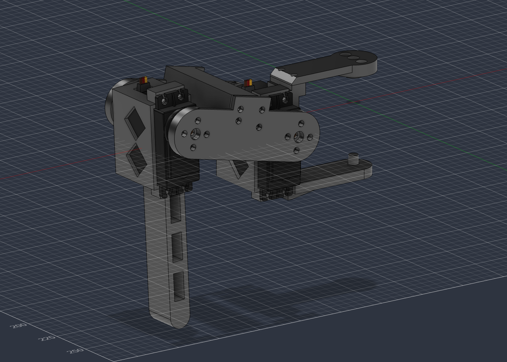
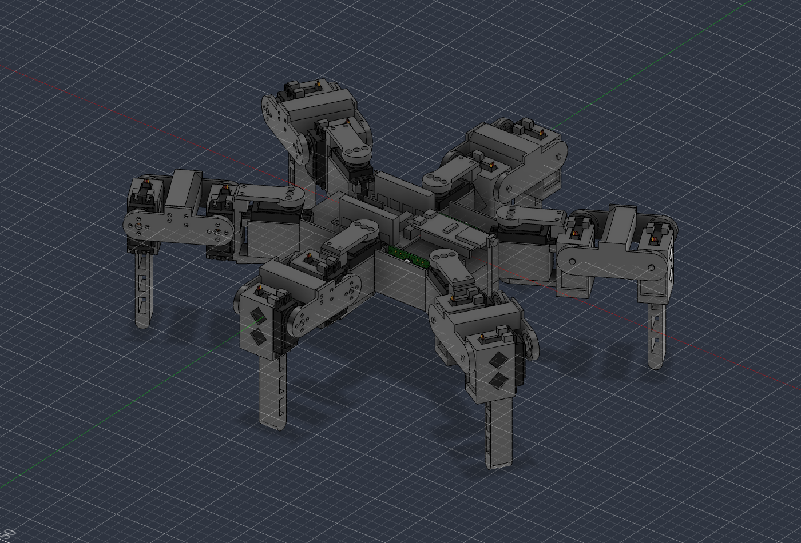
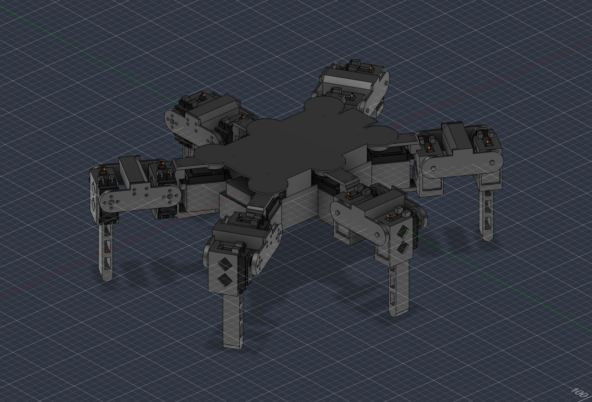

# Progetto meccanico — versione MG996R

Stato al 9 ottobre 2026: **zampa v0.1 modellata, rivista da quattro revisori e corretta** (D-047, D-048, D-049), verificata in Fusion con i giunti veri. Corpo v0 e assieme con sei zampe e giunti di coxa modellati e verificati (D-050).

## Zampa

### Come è nata

Tre architetture indipendenti, ciascuna con una priorità diversa, giudicate da tre revisori. Dettagli, numeri e calcoli dei revisori in `ricerca/zampa-architetture.json`.

| Proposta | Idea | Massa stimata | Esito |
|---|---|---|---|
| scalata | prima versione portata in scala: servo di coxa nel corpo, coxa a C, femore in due piastre, servo del ginocchio nella tibia; coda del servo del femore girata in basso | 84 g (90–98 secondo il revisore geometrico) | **base**: 7,5 / 6 / 7,5 |
| compatta | coxa corta (34 mm) con il servo di coxa girato, femore 60 | 64 g | 5,5 / 4,5 / 6,5: coxa senza registro assiale, femore chiuso da 2 viti |
| robusta | femore a cassone con dentro i servo di anca e ginocchio | 117 g | 6 / 7 / 4,5: femore e ginocchio oltre il 50 % per architettura |

### Architettura

Terna della zampa (componente `Zampa`): origine sull'asse della coxa, all'altezza dell'asse del femore; X verso l'esterno, Y lungo l'asse del femore verso la piastra delle squadrette, Z in alto. Posa di riferimento: femore orizzontale (α = 0), tibia verticale (γ = 90°).

| Parte | Cosa fa | Come si stampa |
|---|---|---|
| `Coxa` | culla del servo del femore (coda in basso), anima verso il corpo che gira fuori dalla gondola, braccio inferiore sotto la gondola con il perno della coxa | orlo della culla (+Y) sul piano, senza supporti |
| `Coxa_Ponte` | braccio superiore della C: porta la squadretta del servo di coxa, avvitato all'anima con 2 M3 e centrato da una linguetta | faccia superiore sul piano |
| `Femore_B` | piastra dei perni (perni di anca e ginocchio forzati) con il blocco cavo che chiude la sezione | faccia esterna sul piano, blocco in piedi |
| `Femore_A` | piastra delle squadrette: porta tutta la coppia tra anca e ginocchio; 8 M3 nelle squadrette, 4 M3 nel blocco | faccia esterna sul piano |
| `Tibia` | culla del servo del ginocchio (coda verso il piede) e stinco cavo | orlo della culla sul piano |
| `Piedino` | cappuccio in TPU | punta in alto |

Quote principali (dal modello di verifica `calc/zampa_escursioni.py`, da confermare nel CAD):

| Grandezza | Valore |
|---|---|
| Lunghezze coxa / femore / tibia | 55 / 65 / 110 mm |
| Larghezza della zampa lungo Y | 61,1 mm (da −30,55 a +30,55) |
| Piano delle alette dei servo di femore e ginocchio (orlo delle culle) | Y = +9,45 |
| Fondo della culla, faccia esterna / flangia del cuscinetto | Y = −24,15 / −24,95 |
| Disco della squadretta | Y da +24,85 a +27,35 |
| Culla nella terna del servo | x da −12,45 a +32,95, semilarghezza 12,45; bugne fino a −18,05 e +38,35; zoccolo pieno sotto la coda; fessura del passacavo larga 6,7 dall'orlo alla finestra |
| Anima della coxa | X da 40,55 a 44,55 (gioco 1,2 dalla gondola, raggio 39,32); testa da X 34 a 44,55, Z da +8,05 a +19,6 |
| Braccio inferiore della coxa | Z da −38,35 a −33,15, nervatura fino a −41,35 |
| Ponte della coxa | mozzo Z da +17,05 a +23,5; braccio da +19,6 a +23,5 (appoggio sulla testa dell'anima) |
| Blocco del femore (terna del femore) | X da 21,5 a 44, Z da −2 a +20, smussi in basso verso il ginocchio e in alto verso l'anca |

### Modello in Fusion (zampa v0)

Script `cad/script/zampa.py`, passi `parametri`, `coxa`, `ponte`, `femore_b`, `femore_a`, `tibia`, `istanze`, `controllo`, `giunti`, `limiti`, `misura`, `scansione`, `interferenze`, `stato`. Tutte le parti hanno la terna della zampa e le quote come espressioni dei parametri (`zam_`, `cul_`, `cox_`, `fem_`, `tib_`, `zy_`, `cz_`, …): cambiando un parametro si rigenera la parte. Dopo aver rigenerato una parte vanno rifatti `giunti` e `limiti` (cancellare una parte cancella i giunti che la usano).

| Parte | Volume pieno | Massa stimata | Note |
|---|---|---|---|
| Coxa | 24,7 cm³ | 25,9 g | culla con zoccolo, anima con tasca a rombo, testa per il ponte, braccio con nervatura |
| Coxa_Ponte | 4,1 cm³ | 5,1 g | |
| Femore_B | 33,0 cm³ | 23,3 g | piastra dei perni e blocco pieno (lo slicer lo stampa a pareti e riempimento) |
| Femore_A | 7,1 cm³ | 9,2 g | |
| Tibia | 25,1 cm³ | 28,3 g | culla con zoccolo e finestre, stinco 12 × 18,9 con tre finestre |
| **Totale** | **94,0 cm³** | **91,8 g** | stima: PETG-CF 1,3 g/cm³, pareti e fondi 1,2 mm, riempimento 25 % |

La massa supera i 70 g del bilancio: sei zampe pesano circa 115 g in più, cioè circa 2 punti di coppia al femore (da 49 a circa 51 % al punto di progetto). Il dato vero viene dallo slicer.

Fissaggio dei servo di femore e ginocchio: lato coda 2 viti M3 in inserti; lato albero 2 viti M3 in fori pilota Ø2,5 (la testata ha la fessura del passacavo, D-049). Le viti delle alette si stringono per ultime, a femore montato. Squadretta della coxa: 2 viti M3 × 5 dall'alto, senza rondella; le teste entrano nei fori del ponte (D-048, D-049).

Dentro `Zampa`: 2 servo, 3 squadrette (anche quella della coxa, che gira con la zampa), 2 cuscinetti (quello della coxa sta nella gondola del corpo), 3 perni; 12 giunti rigidi e 2 di rivoluzione (`G_femore`, `G_ginocchio`). Verso misurato: α = −(valore di G_femore), γ = 90° − (valore di G_ginocchio). Limiti impostati: α da −49° a +85°, γ da 29° a 180°.

Verifiche dopo le correzioni della revisione (9 ottobre 2026):

- posa di riferimento libera; tutte le 212 pose di marcia raggiunte con i limiti impostati e libere;
- campo libero a passi di 1°: femore da −49° a +85° (a −50° la piastra tocca la culla, a +86° il ponte tocca il blocco), ginocchio fino a 180°;
- minimo del ginocchio in funzione del femore, a gioco zero (tabella per il firmware, che aggiunge almeno 3°):

| Femore α | −45 | −40 | −35 | −30…−20 | −15 | −10 | −5 | 0 | +5 | +10…+15 | +20 | +25 | +30 | +35 | ≥ +40 |
|---|---|---|---|---|---|---|---|---|---|---|---|---|---|---|---|
| Ginocchio γ minimo | 54 | 55 | 45 | 46 | 45 | 44 | 43 | 43 | 41 | 39 | 37 | 35 | 33 | 31 | 29 |

- calettamento delle squadrette proposto: servo a metà corsa con α = +20° e γ = 100°; con ±80° di corsa utile si coprono α da −60° a +100° e γ da 20° a 180°, cioè tutto il campo libero.

Verifiche della zampa v0, prima della revisione (9 ottobre 2026):

- posa di riferimento: nessuna interferenza (escluso il mozzo pieno della squadretta sul millerighe, voluto);
- tutte le copie di servo, squadrette, cuscinetti e perni nella posizione prevista (scarto 0,000);
- scansione con i giunti veri ogni 5°, femore da −50° a +90°, ginocchio da 20° a 170°: femore libero da −45° a +85° (a −50° la piastra tocca la culla, a +90° il ponte tocca il blocco); ginocchio libero fino ad almeno 170°, minimo 30° con il femore sopra +35°, 40° con il femore tra 0 e +15°, 45° tra −30° e −5°, 50° sotto −30°;
- tutte le 212 pose di appoggio e volo delle sei andature (`calc/andature.py`, alzata 30) libere;
- manca ancora il corpo: la gondola del servo di coxa limiterà il femore sopra circa +80° (modello 2D) e la rotazione della coxa va verificata con il corpo.

### Escursioni (modello 2D, gioco minimo 1 mm)

- Femore da −46° a +80°. Ginocchio fino a 180°; il minimo dipende dal femore: 49° con α = −30°, 42° con α = 0°, 36° con α = 17,5°, 30° con α ≥ 40°.
- Tutte le pose di appoggio e volo delle sei andature di `calc/andature.py` (da 130/25 a 70/70, alzata 30) sono libere, con gioco minimo 1,6 mm.
- Il firmware deve limitare γ in funzione di α e l'imbardata relativa delle zampe vicine (contatto se ruotano entrambe di 30° una verso l'altra).

### Da fare nella zampa

- Nervature di schiacciamento nelle culle (da tarare sul provino), piedino in TPU, raccordi. Cavi: fascette nel ponte e attorno al femore (D-058).
- Viti delle squadrette della coxa (M3 × 6 con rondella sotto la testa, D-048) da controllare quando si sceglie la squadretta: altezze e posizione dei fori sono stimate (`sq_`).
- Verifica con il corpo: gondola, rotazione della coxa, zampe vicine.
- Vincoli che la zampa pone al corpo: fondo della gondola a −31,95 (flangia del cuscinetto fino a −32,75); braccio della coxa fino a −38,35 e nervatura fino a −41,35 sotto l'asse dei femori; testa dell'anima della coxa a raggio 34–40,55 dall'asse della coxa e da Z +8,05 in su (la gondola, a quel raggio, non deve salire oltre le teste delle viti delle alette, Z +7,05); mozzo del ponte (R12) da Z +17,05 a +23,5 attorno all'asse della coxa; anima a raggio ≥ 40,55 dall'asse della coxa a qualunque angolo.

## Corpo v0 e assieme

Stato: **corpo v0.4**: la v0.3 più colonnine e viti del coperchio e feritoie delle baie anteriori (D-052), basetta dell'ESP32 tagliata a 56 × 35 su quattro colonnine del vassoio (D-053), sportello della batteria con due viti in basso e linguetta sotto il tetto (D-054), Wago in piedi con gli ingressi in alto e costole di F1 (D-055), sportellino con nervature di schiacciamento (D-056), muso del coperchio con la finestra della camera (D-057). La v0.3 è stata corretta dopo la revisione di quattro revisori (D-051, rilievi in `ricerca/corpo-v0-revisione.json`): batteria sfilabile dal retro (provato: 160 mm di corsa senza urti), pareti di collegamento tra gondole, baie e tunnel, regolatori su slitte stampate tra due guide della parete della baia, camera girata con il flat che esce in alto, vassoio su quattro distanziali M3, Wago nelle baie posteriori, T-plug sopra F1 nel vano di coda, apertura di servizio nel coperchio con sportellino. Dopo le correzioni: nessuna interferenza, coxe libere a ±35° e tra vicine a 31°, ciclo a tripode libero a 70/70. Le righe qui sotto descrivono la v0.2 dove non sono state aggiornate: vale D-051.

Disposizione "compatto" (D-050, confronto in `ricerca/corpo-disposizioni.json`). Script `cad/script/corpo.py` (parti) e `cad/script/assieme.py` (istanze, zampe, giunti di coxa, controlli).

| Parte | Cosa fa | Volume pieno |
|---|---|---|
| `Corpo_Base` | tunnel della batteria (parte alta e tetto), ripiano e pareti delle baie, sei gondole (culle uguali a quelle della zampa: fessura del passacavo verso il centro, cuscinetto nel fondo), parete anteriore sopra il tetto con l'apertura per vassoio e basetta, quattro bugne della SSC-32 con fori pilota M2,5 | 140 cm³ |
| `Corpo_Chiglia` | fondo e parte bassa del tunnel, da −41,4 a −31,95 | 24 cm³ |
| `Corpo_Coperchio` | dorso da +28,4 a +30 con i lobi sopra le coxe, gonne laterali sulle pareti delle baie (a 22 mm dagli assi delle coxe) | 40 cm³ |
| `Corpo_Sportello` | sportello della batteria sul retro: piastra e due rebbi alti che premono il pacco (con schiuma) contro la battuta anteriore; sotto i rebbi passa la coppia di T-plug | 5 cm³ |
| `Corpo_Vassoio` | in PETG: piano per la basetta dell'ESP32 su quattro colonnine dal tetto, torretta e mensola della camera con una fessura di 0,5 mm per il flat | 9 cm³ |

Quote: assi delle coxe d'angolo (±80, ±44) a ±30° e ±150°, medie (0, ±48); base 235 × 173 (da z −31,95 a +7), tunnel interno 162 × 50, chiglia fino a −41,4.

Vano di coda (corpo v0.2): fessura nel tetto per i cavi della batteria; portafusibile F1 di traverso sul tetto dietro la SSC-32 (raggiungibile senza togliere il coperchio, dal retro); coppia di T-plug nella zona dei cavi dietro il pacco, raggiungibile aprendo lo sportello della batteria; Wago sul tetto sotto il vassoio, ingressi verso l'esterno.

Fissaggi (corpo v0.1): chiglia con 4 viti M3 in inserti della base, due davanti fuori dal tunnel (orecchie della chiglia) e due dietro nella zona dei cavi della batteria (colonnine della chiglia); regolatori su quattro bugne Ø5,2 ciascuno con inserti M2 nella **parete esterna della baia**, componenti verso il tunnel (6,8 mm d'aria), piazzole in alto (sul fianco del tunnel le bugne alte sarebbero rimaste sopra il tetto, nel vuoto); SSC-32 su quattro bugne del tetto con viti M2,5 in fori pilota; ESP32 con il centro a x 45 (la punta dell'antenna a x 81, davanti c'è la torretta della camera).

Dentro `Corpo`: 6 servo di coxa, 6 cuscinetti, batteria (cavi verso la coda, battuta anteriore), SSC-32 (centro a x −14, morsettiera in avanti), ESP32 (centro a x 54, antenna in avanti), camera (asse a z 22,5, lente a x 98,5), due regolatori in piedi nelle baie anteriori. Sei istanze di `Zampa` alla radice (`Zampa:1`…`Zampa:6` = AS, MS, PS, AD, MD, PD), giunti di rivoluzione `G_coxa_*` alla radice tra `Corpo_Base` e la `Coxa` di ogni istanza, limiti ±35°. `Corpo` è fissato.

Verifiche (9 ottobre 2026), con i giunti veri:

- posizioni di tutte le istanze nel corpo e delle sei zampe: scarto 0,000;
- posa di riferimento: nessuna interferenza in tutto l'assieme (il controllo funziona: aveva trovato le pareti delle baie contro i servo di coxa medi, 178 mm³ ciascuno, poi corrette);
- ogni zampa da sola a ±20° e ±35° di coxa: libera;
- zampe vicine ruotate una verso l'altra: libere a 31° ciascuna, contatto a 34° (anteriore–media e media–posteriore); coppie anteriore e posteriore libere a 34°.

### Ciclo a tripode sul modello (9 ottobre 2026)

`assieme.py` → `ciclo`: per ogni fase calcola imbardata, femore e ginocchio di ognuna delle sei zampe (piede neutro a Lc + x_f0 dalla coxa, passo 60 lungo X, volo a parabola con alzata 30) e atteggia le zampe una per una imponendo le trasformate delle parti annidate (`posa_zampa`); poi controlla le interferenze di tutto l'assieme e ripristina.

- Controllo del metodo: una zampa con il femore a −60° e due zampe vicine a 40° una verso l'altra danno gli urti attesi.
- Assetti 100/45 e 130/25: quattro fasi (0, 1/8, 1/4, 3/8 del ciclo; la seconda metà è simmetrica): **nessun urto**.
- Assetti bassi 80/60 e 70/70: sedici fasi: **nessun urto**; il ginocchio scende al minimo a 41°. La correzione del piede delle zampe d'angolo prevista dal modello 2D non serve con questa traiettoria.
- **Rotazione sul posto** (`ciclo` con `giro`, 9 ottobre 2026): i piedi in appoggio girano attorno al centro del corpo. Con 30° a ogni passo le imbardate arrivano a ±28° sulle zampe d'angolo e ±22° sulle medie (limite del firmware ±30°) e la somma tra vicine a 50° (limite 60°). Otto fasi a 100/45 e otto a 70/70 (ginocchio al minimo a 46,6°): **nessun urto**. Controllo: con 75° a ogni passo (imbardate fino a 63°) il controllo trova gli urti tra zampe vicine. Il giro in senso orario è lo specchio di questo.
- **Campo della camera**: con la lente da 120° (diagonale; circa 54° per lato in orizzontale su un sensore 4:3) i ginocchi delle zampe anteriori stanno a circa 54° dall'asse, cioè sul bordo dell'immagine, e ci entrano e escono con l'imbardata. Stima geometrica, da guardare sulle prime immagini: se disturbano si scontornano in firmware.

### Cavi dei servo (9 ottobre 2026)

`calc/cavi_servo.py` stima i percorsi dal punto in cui il cavo esce dalla cassa (posizioni lette dal modello nella posa di riferimento) fino alla spina sulla SSC-32: il cavo di coxa sale dalla culla nella baia e corre sotto il coperchio; quelli di femore e ginocchio risalgono sopra la zampa, seguono femore e coxa a z 25, passano sopra l'asse della coxa ed entrano sotto il coperchio. Fattore 1,15 per curve e fascette, anse di 10 mm per l'imbardata, 17 per l'anca, 20 per il ginocchio (D-058; il cavo del femore attraversa solo l'imbardata). Canali: zampe anteriori sui canali davanti, posteriori su quelli dietro (sedici per lato, file a |y| 23,5 da x 10 a −39).

| Servo | Percorso (mm) | Margine su 300 utili |
|---|---|---|
| coxa (A, M, P) | 129, 70, 112 | 57–77 % |
| femore (A, M, P) | 180, 117, 158 | 40–61 % |
| ginocchio (A, M, P) | 295, 231, 267 | 2 %, 23 %, 11 % |

Lato destro uguale entro 1 mm. Servono **4 prolunghe** per i ginocchi delle zampe d'angolo (voce C5). Gli altri cavi sono più lunghi del necessario: circa 1,1 m di cavo in più per lato, da raccogliere in anse nelle baie posteriori sopra i Wago (circa 5 cm³ per lato contro 28 cm³ liberi), lontano dal camino d'aria delle baie anteriori. Fascette lungo la zampa: una nelle feritoie del ponte, una attorno al femore vicino all'anca (D-058).

### Massa e baricentro dal modello (9 ottobre 2026; corpo aggiornato alla v0.4)

| Voce | Massa (g) |
|---|---|
| 18 servo MG996R | 990 |
| 18 squadrette, 18 cuscinetti, 18 perni | 145 |
| Parti stampate delle sei zampe | 552 (92 a zampa) |
| Parti stampate del corpo v0.4: base 198, coperchio con muso 52, chiglia 33, vassoio 9, sportello 7, due slitte 11, sportellino 5 | 314 |
| Batteria, SSC-32, ESP32, camera, due regolatori | 340 |
| **Totale modellato** | **2341** |
| Non modellato (stima): cavi e connettori 160, viteria e inserti 140, basetta e logica 25, piedini 15, fusibili, Wago, T-plug, cicalino, interruttore 45 | circa 385 |
| **Totale atteso** | **circa 2730** |

Parti stampate con il fattore di riempimento stimato (pareti e fondi 1,2 mm, riempimento 25 %); comprate con la massa dichiarata. Baricentro del modellato nella posa di riferimento: (+1,7; 0; −11,7) mm, cioè quasi sul centro in pianta e 12 mm sotto il piano dei femori. La massa di progetto del calcolo statico (2750 g) resta sopra l'attesa, ma ormai di soli 20 g: la base (198 g, quasi tutta pareti sottili) è la voce da guardare nello slicer.

### Da fare nel corpo

- Interruttore e cicalino (da decidere: vedi le domande in `BOM.md`); pettini per le anse dei cavi nelle baie posteriori (percorsi e lunghezze: sezione "Cavi dei servo"). Note di stampa della base in D-056.
